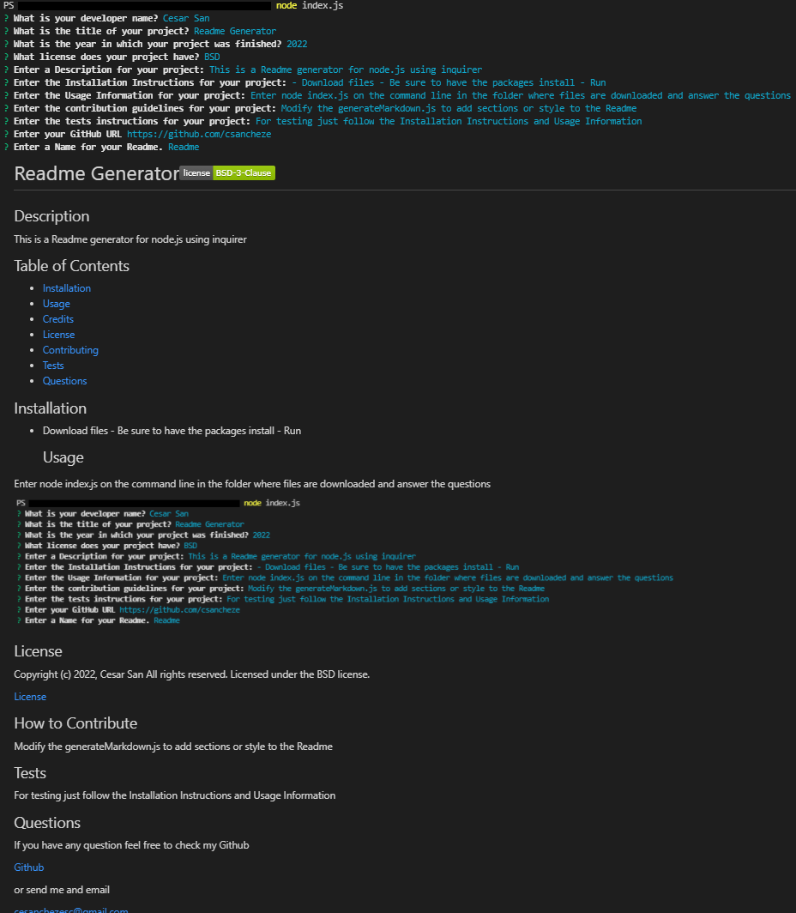

# Readme Generator 

  
  
  ## Description
  
  
This is a Readme generator for node.js using inquirer. It was based on the code given but there were a few modifications. One function was enough to get the license information to be sent to the markdown generator. A module for choosing the corresponding text to create the matching license file was created and the added to the index.js via module.exports. At last some fixes were made to some bugs and to match the criteria.

  
  ## Table of Contents
  
  - [Installation](#installation)
  - [Usage](#usage)
  - [Credits](#credits)
  - [License](#license)
  - [Contributing](#license)
  - [Tests](#license)
  - [Questions](#license)
  
  ## Installation
  
  
- Download files - Be sure to have the packages install - Run

  
  ## Usage
  
  
Enter node index.js on the command line in the folder where files are downloaded and answer the questions. Be sure to change the assets/images/screenshot.png to match your project.

  
  

  
  ## License
  
  
Copyright (c) 2022, Cesar San All rights reserved.
Licensed under the BSD license. 

  
  
[License](./BSD_license.txt)

  
  ## How to Contribute
  
  
Modify the generateMarkdown.js to add sections or style to the Readme

  
  ## Tests
  
  
For testing just follow the Installation Instructions and Usage Information

  
  ## Questions
  
  If you have any question feel free to check my Github

Username: csancheze
  
[Github](https://github.com/csancheze)

  or send me and email
  
<cesanchezesc@gmail.com>

